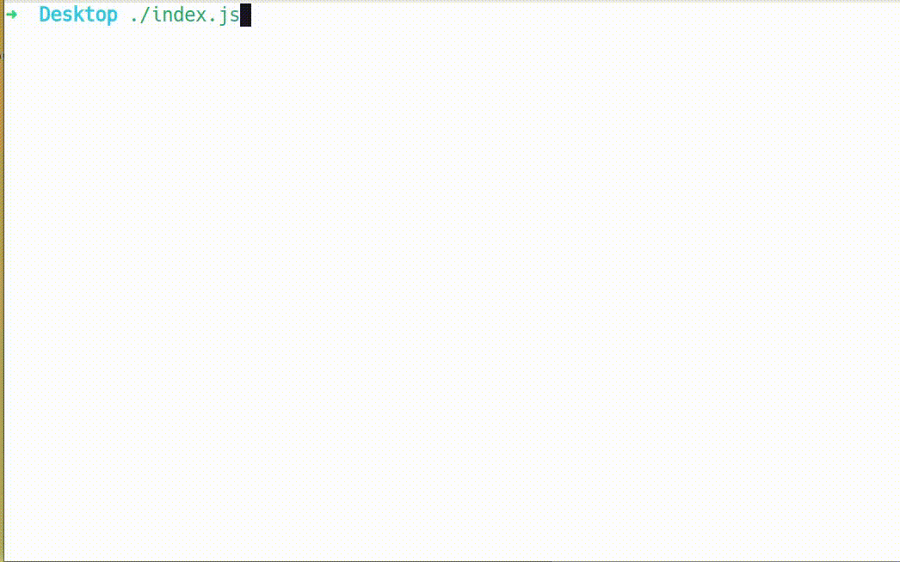
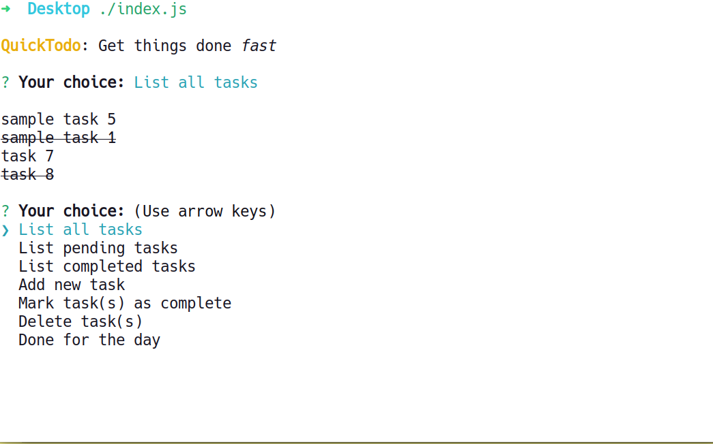
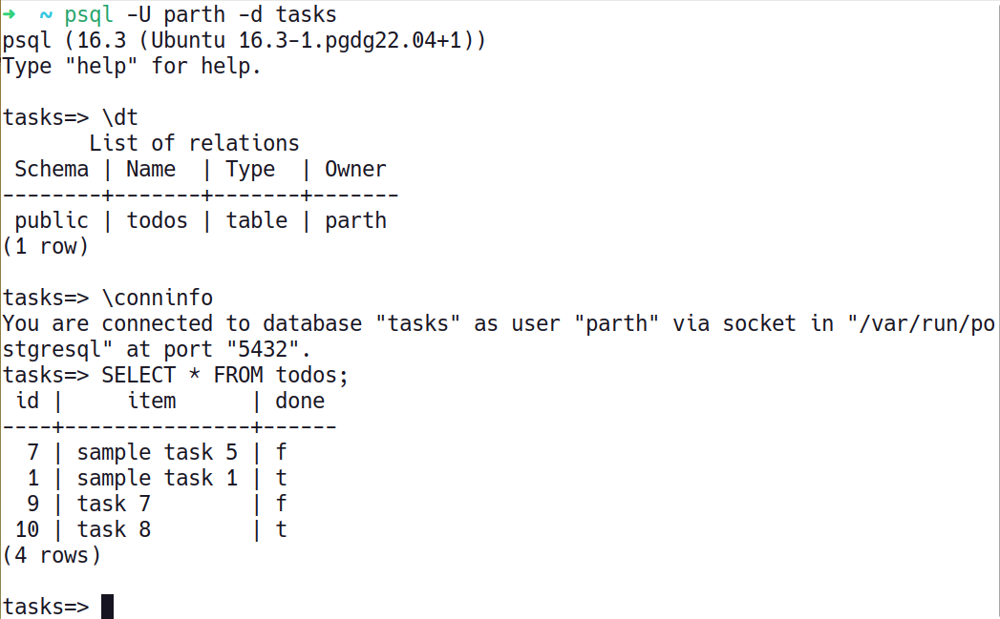

# QuickToDo

A Node.js CLI ToDo application with PostgreSQL database


## Demo



## Usage/Examples

```sh
./index.js
```


## Installation

```bash
  cd quicktodo
  npm install
```
    
## Environment Variables

To run this project, you will need to add the following environment variables to your `.env` file for connecting it to PostgreSQL database

`USER`, `DB`, `PASSWORD`, `PORT=5432`, `HOST='localhost'`, `TABLE`


## Screenshots




## Libraries and Packages Used

- [inquirer](https://github.com/SBoudrias/Inquirer.js)
- [chalk](https://github.com/chalk/chalk)
- [pg](https://github.com/brianc/node-postgres)
## License

[MIT](https://choosealicense.com/licenses/mit/)

